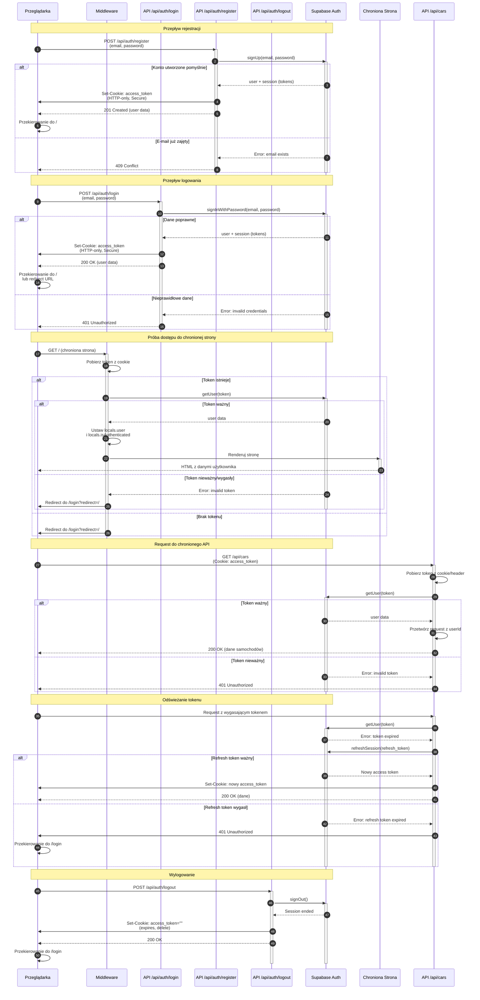

# Diagram przepływu autentykacji - JustFuel

<authentication_analysis>

## Analiza przepływów autentykacji

### 1. Przepływy autentykacji wymienione w dokumentacji:

**Rejestracja użytkownika (US-001):**
- Użytkownik wchodzi na `/register`
- Wypełnia formularz (e-mail, hasło, potwierdzenie hasła)
- Walidacja danych w czasie rzeczywistym
- Wywołanie API `/api/auth/register`
- Supabase Auth tworzy konto i automatycznie loguje użytkownika
- Token zapisywany w HTTP-only cookie
- Przekierowanie do `/` (główna strona z listą samochodów)

**Logowanie użytkownika (US-002):**
- Użytkownik wchodzi na `/login` (lub jest przekierowany z chronionej strony)
- Wypełnia formularz (e-mail, hasło)
- Walidacja danych
- Wywołanie API `/api/auth/login`
- Supabase Auth weryfikuje dane
- Token zapisywany w HTTP-only cookie
- Przekierowanie do `/` lub URL z parametru `redirect`

**Wylogowanie użytkownika (US-003):**
- Użytkownik klika przycisk "Wyloguj"
- Wywołanie API `/api/auth/logout`
- Supabase Auth kończy sesję
- Usunięcie tokenu z HTTP-only cookie
- Przekierowanie do `/login`

**Próba dostępu do chronionej strony:**
- Użytkownik wchodzi na chronioną stronę (np. `/`, `/cars`)
- Middleware sprawdza autoryzację
- Jeśli niezalogowany → przekierowanie do `/login?redirect=<current-url>`
- Jeśli zalogowany → renderowanie strony

**Weryfikacja tokenu w endpointach API:**
- Każdy request do API zawiera token w cookie lub headerze Authorization
- Endpoint weryfikuje token przez Supabase Auth
- Jeśli token ważny → przetwarzanie requestu
- Jeśli token nieważny → zwrócenie 401 Unauthorized

**Odświeżanie tokenu:**
- Access token wygasa po 1 godzinie
- System automatycznie odświeża token używając refresh token
- Jeśli refresh token wygasł → wylogowanie i przekierowanie do `/login`

### 2. Główni aktorzy i ich interakcje:

1. **Przeglądarka (Browser)** - interfejs użytkownika, wysyła requesty, przechowuje cookies
2. **Middleware (Astro Middleware)** - sprawdza autoryzację przed renderowaniem stron, przekierowuje niezalogowanych
3. **Astro API** - endpointy `/api/auth/*` obsługujące operacje autentykacji
4. **Supabase Auth** - serwis autentykacji zarządzający użytkownikami, sesjami i tokenami

### 3. Procesy weryfikacji i odświeżania tokenów:

**Weryfikacja tokenu:**
- Token pobierany z HTTP-only cookie lub headeru Authorization
- Weryfikacja przez `supabase.auth.getUser(token)`
- Jeśli token ważny → użytkownik autoryzowany
- Jeśli token nieważny/wygasły → błąd 401

**Odświeżanie tokenu:**
- Access token wygasa po 3600 sekund (1 godzina)
- Refresh token używany do automatycznego odświeżania
- Implementacja w `useAuth` hook lub middleware
- Jeśli refresh token wygasł → wylogowanie użytkownika

### 4. Opis kroków autentykacji:

**Krok 1 - Rejestracja:**
1. Użytkownik wypełnia formularz rejestracji
2. Przeglądarka wysyła POST do `/api/auth/register` z danymi
3. API wywołuje `supabase.auth.signUp()`
4. Supabase tworzy konto i zwraca sesję z tokenami
5. API zapisuje token w HTTP-only cookie
6. Przeglądarka otrzymuje odpowiedź sukcesu
7. Przekierowanie do strony głównej

**Krok 2 - Logowanie:**
1. Użytkownik wypełnia formularz logowania
2. Przeglądarka wysyła POST do `/api/auth/login` z danymi
3. API wywołuje `supabase.auth.signInWithPassword()`
4. Supabase weryfikuje dane i zwraca sesję
5. API zapisuje token w HTTP-only cookie
6. Przekierowanie do strony głównej lub redirect URL

**Krok 3 - Dostęp do chronionej strony:**
1. Użytkownik próbuje wejść na chronioną stronę
2. Middleware sprawdza token z cookie
3. Middleware weryfikuje token przez Supabase
4. Jeśli token ważny → renderowanie strony
5. Jeśli token nieważny → przekierowanie do `/login`

**Krok 4 - Request do API:**
1. Przeglądarka wysyła request do API z tokenem w cookie
2. Endpoint API pobiera token
3. Endpoint weryfikuje token przez Supabase
4. Jeśli token ważny → przetwarzanie requestu
5. Jeśli token nieważny → zwrócenie 401

**Krok 5 - Odświeżanie tokenu:**
1. System wykrywa, że access token wygasa
2. Użycie refresh token do odświeżenia
3. Wywołanie `supabase.auth.refreshSession()`
4. Supabase zwraca nowy access token
5. Zapisanie nowego tokenu w cookie

**Krok 6 - Wylogowanie:**
1. Użytkownik klika przycisk "Wyloguj"
2. Przeglądarka wysyła POST do `/api/auth/logout`
3. API wywołuje `supabase.auth.signOut()`
4. Supabase kończy sesję
5. API usuwa token z cookie
6. Przekierowanie do `/login`

</authentication_analysis>

<mermaid_diagram>

</mermaid_diagram>

