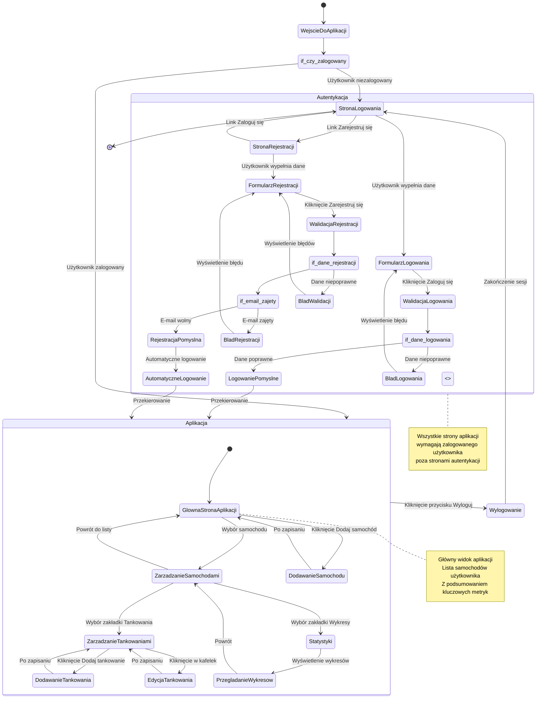

# Diagram podróży użytkownika - JustFuel

<user_journey_analysis>

## Analiza podróży użytkownika

### 1. Ścieżki użytkownika wymienione w dokumentacji:

**Rejestracja nowego użytkownika (US-001):**

- Użytkownik wchodzi na stronę rejestracji
- Wypełnia formularz (e-mail, hasło, potwierdzenie hasła)
- System waliduje dane w czasie rzeczywistym
- Po pomyślnej rejestracji: automatyczne logowanie
- Przekierowanie do głównego widoku aplikacji (lista samochodów na `/`)

**Logowanie użytkownika (US-002):**

- Użytkownik wchodzi na stronę logowania (lub jest przekierowany z chronionej strony)
- Wypełnia formularz (e-mail, hasło)
- System waliduje dane
- Po pomyślnym logowaniu: przekierowanie do głównego widoku aplikacji (`/`) lub URL z parametru `redirect`
- Użytkownik nie może korzystać z aplikacji, jeśli nie jest zalogowany
- Wszystkie strony i endpointy API wymagają sesji zalogowanego użytkownika

**Wylogowanie użytkownika (US-003):**

- Użytkownik klika przycisk "Wyloguj" (po prawej u góry)
- Sesja zostaje zakończona
- Przekierowanie do strony logowania

**Próba dostępu do chronionej strony:**

- Użytkownik próbuje wejść na chronioną stronę (np. `/`, `/cars`)
- System sprawdza autoryzację
- Jeśli niezalogowany → przekierowanie do `/login?redirect=<current-url>`
- Jeśli zalogowany → dostęp do strony

**Odzyskiwanie hasła (opcjonalne, poza zakresem MVP):**

- Użytkownik wchodzi na stronę odzyskiwania hasła
- Wprowadza adres e-mail
- Otrzymuje e-mail z linkiem resetującym
- Kliknięcie w link → strona resetowania hasła
- Wprowadzenie nowego hasła
- Przekierowanie do strony logowania

### 2. Główne podróże i odpowiadające stany:

**Podróż 1: Nowy użytkownik (rejestracja)**

- Stan początkowy: Wejście do aplikacji
- Stany pośrednie: Strona rejestracji → Walidacja danych → Rejestracja → Automatyczne logowanie
- Stan końcowy: Główna strona aplikacji (lista samochodów)

**Podróż 2: Powracający użytkownik (logowanie)**

- Stan początkowy: Wejście do aplikacji lub próba dostępu do chronionej strony
- Stany pośrednie: Strona logowania → Walidacja danych → Logowanie
- Stan końcowy: Główna strona aplikacji (lista samochodów)

**Podróż 3: Użytkownik korzystający z aplikacji**

- Stan początkowy: Główna strona aplikacji (lista samochodów)
- Stany pośrednie: Zarządzanie samochodami → Zarządzanie tankowaniami → Statystyki
- Stan końcowy: Kontynuacja korzystania z aplikacji lub wylogowanie

**Podróż 4: Wylogowanie**

- Stan początkowy: Dowolna strona aplikacji (gdy użytkownik jest zalogowany)
- Stany pośrednie: Kliknięcie przycisku "Wyloguj" → Zakończenie sesji
- Stan końcowy: Strona logowania

**Podróż 5: Odzyskiwanie hasła (opcjonalne)**

- Stan początkowy: Strona logowania lub strona odzyskiwania hasła
- Stany pośrednie: Wprowadzenie e-maila → Otrzymanie e-maila → Resetowanie hasła
- Stan końcowy: Strona logowania

### 3. Punkty decyzyjne i alternatywne ścieżki:

**Punkt decyzyjny 1: Czy użytkownik jest zalogowany?**

- TAK → Dostęp do głównej strony aplikacji
- NIE → Przekierowanie do strony logowania

**Punkt decyzyjny 2: Czy dane rejestracji są poprawne?**

- TAK → Rejestracja pomyślna → Automatyczne logowanie
- NIE → Wyświetlenie błędów walidacji → Powrót do formularza

**Punkt decyzyjny 3: Czy e-mail jest już zajęty?**

- TAK → Komunikat błędu "Konto z tym adresem e-mail już istnieje"
- NIE → Kontynuacja rejestracji

**Punkt decyzyjny 4: Czy dane logowania są poprawne?**

- TAK → Logowanie pomyślne → Przekierowanie do głównej strony
- NIE → Komunikat błędu "Nieprawidłowy adres e-mail lub hasło"

**Punkt decyzyjny 5: Czy użytkownik chce się zarejestrować?**

- TAK → Przekierowanie do strony rejestracji
- NIE → Pozostanie na stronie logowania

**Punkt decyzyjny 6: Czy użytkownik chce się wylogować?**

- TAK → Zakończenie sesji → Przekierowanie do logowania
- NIE → Kontynuacja korzystania z aplikacji

### 4. Opis celu każdego stanu:

**Wejście do aplikacji**: Punkt początkowy podróży użytkownika, system sprawdza status autoryzacji

**Strona logowania**: Umożliwia zalogowanie się istniejącym użytkownikom, zawiera link do rejestracji

**Strona rejestracji**: Umożliwia utworzenie nowego konta, zawiera link do logowania

**Walidacja danych**: Sprawdzenie poprawności wprowadzonych danych (format e-mail, długość hasła, zgodność haseł)

**Rejestracja**: Proces tworzenia nowego konta w systemie

**Logowanie**: Proces uwierzytelnienia użytkownika w systemie

**Główna strona aplikacji**: Lista samochodów użytkownika, główny widok po zalogowaniu

**Zarządzanie samochodami**: Dodawanie, edycja, usuwanie samochodów

**Zarządzanie tankowaniami**: Dodawanie, edycja, usuwanie wpisów o tankowaniach

**Statystyki**: Przeglądanie wykresów i analiz zużycia paliwa

**Wylogowanie**: Zakończenie sesji użytkownika i przekierowanie do logowania

**Odzyskiwanie hasła**: Proces resetowania hasła przez e-mail (opcjonalne)

</user_journey_analysis>

<mermaid_diagram>

</mermaid_diagram>
