# Diagram Architektury UI - Moduł Autentykacji JustFuel

<architecture_analysis>

## Analiza komponentów systemu autentykacji

### 1. Strony Astro (Server-side)

**Nowe strony autentykacji:**
- `src/pages/login.astro` - Strona logowania użytkownika (publiczna)
- `src/pages/register.astro` - Strona rejestracji nowego użytkownika (publiczna)
- `src/pages/forgot-password.astro` - Strona żądania resetowania hasła (opcjonalna, poza MVP)
- `src/pages/reset-password.astro` - Strona resetowania hasła z tokenem (opcjonalna, poza MVP)

**Modyfikowane strony:**
- `src/pages/index.astro` - Główna strona z listą samochodów (wymaga autoryzacji)
- `src/pages/cars.astro` - Strona listy samochodów (wymaga autoryzacji)
- `src/pages/cars/[carId].astro` - Strona szczegółów samochodu (wymaga autoryzacji)
- `src/pages/cars/[carId]/fillups/new.astro` - Strona dodawania tankowania (wymaga autoryzacji)
- `src/pages/cars/[carId]/fillups/[fillupId]/edit.astro` - Strona edycji tankowania (wymaga autoryzacji)

### 2. Layouty Astro

**Nowe layouty:**
- `src/layouts/AuthLayout.astro` - Layout dedykowany dla stron autentykacji (minimalistyczny, bez nawigacji)

**Modyfikowane layouty:**
- `src/layouts/Layout.astro` - Główny layout aplikacji (dodanie komponentu AuthHeader)

### 3. Komponenty React (Client-side)

**Nowe komponenty autentykacji:**
- `src/components/auth/LoginForm.tsx` - Formularz logowania z walidacją
- `src/components/auth/RegisterForm.tsx` - Formularz rejestracji z walidacją
- `src/components/auth/AuthHeader.tsx` - Nagłówek z przyciskiem wylogowania
- `src/components/auth/AuthError.tsx` - Komponent wyświetlający błędy autentykacji
- `src/components/auth/AuthSuccess.tsx` - Komponent wyświetlający komunikaty sukcesu
- `src/components/auth/ForgotPasswordForm.tsx` - Formularz żądania resetowania hasła (opcjonalny)
- `src/components/auth/ResetPasswordForm.tsx` - Formularz resetowania hasła (opcjonalny)

**Istniejące komponenty (wymagają modyfikacji):**
- `src/components/cars/CarsListView.tsx` - Usunięcie logiki localStorage, użycie useAuth hook

### 4. Custom Hooks React

**Nowe hooki:**
- `src/lib/hooks/useLoginForm.ts` - Logika formularza logowania (stan, walidacja, submit)
- `src/lib/hooks/useRegisterForm.ts` - Logika formularza rejestracji (stan, walidacja, submit)
- `src/lib/hooks/useAuth.ts` - Globalny hook zarządzania stanem autoryzacji (user, login, logout, refreshSession)
- `src/lib/hooks/useForgotPasswordForm.ts` - Logika formularza żądania resetowania (opcjonalny)
- `src/lib/hooks/useResetPasswordForm.ts` - Logika formularza resetowania hasła (opcjonalny)

**Istniejące hooki (wymagają modyfikacji):**
- `src/lib/hooks/useCarsList.ts` - Usunięcie logiki localStorage, użycie useAuth
- `src/lib/hooks/useCarDetails.ts` - Usunięcie logiki localStorage, użycie useAuth
- `src/lib/hooks/useFillupsView.ts` - Usunięcie logiki localStorage, użycie useAuth
- `src/lib/hooks/useNewCarForm.ts` - Usunięcie logiki localStorage, użycie useAuth
- `src/lib/hooks/useEditCarForm.ts` - Usunięcie logiki localStorage, użycie useAuth
- `src/lib/hooks/useNewFillupForm.ts` - Usunięcie logiki localStorage, użycie useAuth
- `src/lib/hooks/useEditFillupForm.ts` - Usunięcie logiki localStorage, użycie useAuth

### 5. Endpointy API

**Nowe endpointy autentykacji:**
- `src/pages/api/auth/login.ts` - POST - Logowanie użytkownika
- `src/pages/api/auth/register.ts` - POST - Rejestracja nowego użytkownika
- `src/pages/api/auth/logout.ts` - POST - Wylogowanie użytkownika
- `src/pages/api/auth/session.ts` - GET - Sprawdzenie aktualnej sesji
- `src/pages/api/auth/forgot-password.ts` - POST - Żądanie resetowania hasła (opcjonalny)
- `src/pages/api/auth/reset-password.ts` - POST - Resetowanie hasła z tokenem (opcjonalny)

**Modyfikowane endpointy:**
- `src/pages/api/cars.ts` - Zastąpienie DEFAULT_USER_ID przez requireAuth()
- `src/pages/api/cars/[carId].ts` - Zastąpienie DEFAULT_USER_ID przez requireAuth()
- `src/pages/api/cars/[carId]/fillups.ts` - Zastąpienie DEFAULT_USER_ID przez requireAuth()
- `src/pages/api/cars/[carId]/fillups/[fillupId].ts` - Zastąpienie DEFAULT_USER_ID przez requireAuth()
- `src/pages/api/cars/[carId]/statistics.ts` - Zastąpienie DEFAULT_USER_ID przez requireAuth()
- `src/pages/api/cars/[carId]/charts.ts` - Zastąpienie DEFAULT_USER_ID przez requireAuth()

### 6. Serwisy i walidacja

**Nowe serwisy:**
- `src/lib/services/auth.service.ts` - Funkcje autentykacji (loginUser, registerUser, logoutUser, getUserFromToken, refreshSession)

**Nowa walidacja:**
- `src/lib/validation/auth.ts` - Schematy Zod dla autentykacji (loginSchema, registerSchema)

**Nowe utils:**
- `src/lib/utils/auth.ts` - Helper funkcje (getUserFromRequest, requireAuth)

### 7. Middleware

**Modyfikowany middleware:**
- `src/middleware/index.ts` - Rozszerzenie o logikę sprawdzania autoryzacji, przekierowania, ustawianie context.locals.user i context.locals.isAuthenticated

### 8. Przepływ danych

**Rejestracja:**
Użytkownik → register.astro → RegisterForm → useRegisterForm → POST /api/auth/register → auth.service.ts → Supabase Auth → HTTP-only cookie → Przekierowanie do /

**Logowanie:**
Użytkownik → login.astro → LoginForm → useLoginForm → POST /api/auth/login → auth.service.ts → Supabase Auth → HTTP-only cookie → Przekierowanie do / lub redirect URL

**Dostęp do chronionej strony:**
Użytkownik → Chroniona strona → Middleware sprawdza token → Jeśli ważny: renderowanie strony, jeśli nieważny: przekierowanie do /login

**Request do API:**
Komponent → Hook → API endpoint → requireAuth() → auth.service.ts → Supabase Auth → Zwrócenie danych

**Wylogowanie:**
Użytkownik → AuthHeader → useAuth → POST /api/auth/logout → auth.service.ts → Supabase Auth → Usunięcie cookie → Przekierowanie do /login

```mermaid
flowchart TD
    subgraph "Strony Publiczne Autentykacji"
        LoginPage["login.astro<br/>Strona Logowania"]
        RegisterPage["register.astro<br/>Strona Rejestracji"]
        ForgotPasswordPage["forgot-password.astro<br/>Strona Odzyskiwania Hasła<br/>(Opcjonalna)"]
        ResetPasswordPage["reset-password.astro<br/>Strona Resetowania Hasła<br/>(Opcjonalna)"]
    end

    subgraph "Layouty"
        AuthLayout["AuthLayout.astro<br/>Layout dla Stron Autentykacji"]
        MainLayout["Layout.astro<br/>Główny Layout<br/>(Zmodyfikowany)"]
    end

    subgraph "Komponenty Formularzy Autentykacji"
        LoginForm["LoginForm.tsx<br/>Formularz Logowania"]
        RegisterForm["RegisterForm.tsx<br/>Formularz Rejestracji"]
        AuthHeader["AuthHeader.tsx<br/>Nagłówek z Przyciskiem Wylogowania"]
        AuthError["AuthError.tsx<br/>Komponent Błędów"]
        AuthSuccess["AuthSuccess.tsx<br/>Komponent Sukcesu"]
        ForgotPasswordForm["ForgotPasswordForm.tsx<br/>(Opcjonalny)"]
        ResetPasswordForm["ResetPasswordForm.tsx<br/>(Opcjonalny)"]
    end

    subgraph "Custom Hooks Autentykacji"
        UseLoginForm["useLoginForm.ts<br/>Logika Formularza Logowania"]
        UseRegisterForm["useRegisterForm.ts<br/>Logika Formularza Rejestracji"]
        UseAuth["useAuth.ts<br/>Globalny Hook Autoryzacji"]
        UseForgotPasswordForm["useForgotPasswordForm.ts<br/>(Opcjonalny)"]
        UseResetPasswordForm["useResetPasswordForm.ts<br/>(Opcjonalny)"]
    end

    subgraph "Strony Chronione"
        IndexPage["index.astro<br/>Główna Strona<br/>(Zmodyfikowana)"]
        CarsPage["cars.astro<br/>Lista Samochodów<br/>(Zmodyfikowana)"]
        CarDetailsPage["cars/[carId].astro<br/>Szczegóły Samochodu<br/>(Zmodyfikowana)"]
        NewFillupPage["cars/[carId]/fillups/new.astro<br/>(Zmodyfikowana)"]
        EditFillupPage["cars/[carId]/fillups/[fillupId]/edit.astro<br/>(Zmodyfikowana)"]
    end

    subgraph "Komponenty Aplikacji"
        CarsListView["CarsListView.tsx<br/>Lista Samochodów<br/>(Zmodyfikowana)"]
        CarDetailsView["CarDetailsView.tsx"]
        FillupsView["FillupsView.tsx"]
    end

    subgraph "Hooks Aplikacji"
        UseCarsList["useCarsList.ts<br/>(Zmodyfikowany)"]
        UseCarDetails["useCarDetails.ts<br/>(Zmodyfikowany)"]
        UseFillupsView["useFillupsView.ts<br/>(Zmodyfikowany)"]
        UseNewCarForm["useNewCarForm.ts<br/>(Zmodyfikowany)"]
        UseEditCarForm["useEditCarForm.ts<br/>(Zmodyfikowany)"]
        UseNewFillupForm["useNewFillupForm.ts<br/>(Zmodyfikowany)"]
        UseEditFillupForm["useEditFillupForm.ts<br/>(Zmodyfikowany)"]
    end

    subgraph "Endpointy API Autentykacji"
        LoginAPI["/api/auth/login.ts<br/>POST - Logowanie"]
        RegisterAPI["/api/auth/register.ts<br/>POST - Rejestracja"]
        LogoutAPI["/api/auth/logout.ts<br/>POST - Wylogowanie"]
        SessionAPI["/api/auth/session.ts<br/>GET - Sprawdzenie Sesji"]
        ForgotPasswordAPI["/api/auth/forgot-password.ts<br/>(Opcjonalny)"]
        ResetPasswordAPI["/api/auth/reset-password.ts<br/>(Opcjonalny)"]
    end

    subgraph "Endpointy API Aplikacji"
        CarsAPI["/api/cars.ts<br/>(Zmodyfikowany)"]
        CarDetailsAPI["/api/cars/[carId].ts<br/>(Zmodyfikowany)"]
        FillupsAPI["/api/cars/[carId]/fillups.ts<br/>(Zmodyfikowany)"]
        FillupDetailsAPI["/api/cars/[carId]/fillups/[fillupId].ts<br/>(Zmodyfikowany)"]
        StatisticsAPI["/api/cars/[carId]/statistics.ts<br/>(Zmodyfikowany)"]
        ChartsAPI["/api/cars/[carId]/charts.ts<br/>(Zmodyfikowany)"]
    end

    subgraph "Serwisy i Walidacja"
        AuthService["auth.service.ts<br/>Serwis Autentykacji"]
        AuthValidation["validation/auth.ts<br/>Walidacja Autentykacji"]
        AuthUtils["utils/auth.ts<br/>Helper Funkcje<br/>(requireAuth, getUserFromRequest)"]
        CarsService["cars.service.ts"]
        FillupsService["fillups.service.ts"]
    end

    subgraph "Middleware i Infrastruktura"
        Middleware["middleware/index.ts<br/>Middleware Autoryzacji<br/>(Zmodyfikowany)"]
        SupabaseClient["supabase.client.ts<br/>Klient Supabase"]
        SupabaseAuth["Supabase Auth<br/>Zarządzanie Sesjami"]
    end

    %% Strony publiczne
    LoginPage --> AuthLayout
    RegisterPage --> AuthLayout
    ForgotPasswordPage --> AuthLayout
    ResetPasswordPage --> AuthLayout

    %% Komponenty w layoutach
    AuthLayout --> LoginForm
    AuthLayout --> RegisterForm
    AuthLayout --> ForgotPasswordForm
    AuthLayout --> ResetPasswordForm
    MainLayout --> AuthHeader
    MainLayout --> IndexPage
    MainLayout --> CarsPage
    MainLayout --> CarDetailsPage
    MainLayout --> NewFillupPage
    MainLayout --> EditFillupPage

    %% Formularze do hooków
    LoginForm --> UseLoginForm
    RegisterForm --> UseRegisterForm
    AuthHeader --> UseAuth
    ForgotPasswordForm --> UseForgotPasswordForm
    ResetPasswordForm --> UseResetPasswordForm

    %% Hooki do API
    UseLoginForm --> LoginAPI
    UseRegisterForm --> RegisterAPI
    UseAuth --> LogoutAPI
    UseAuth --> SessionAPI
    UseForgotPasswordForm --> ForgotPasswordAPI
    UseResetPasswordForm --> ResetPasswordAPI

    %% API do serwisów
    LoginAPI --> AuthService
    RegisterAPI --> AuthService
    LogoutAPI --> AuthService
    SessionAPI --> AuthService
    ForgotPasswordAPI --> AuthService
    ResetPasswordAPI --> AuthService

    %% Walidacja
    LoginAPI --> AuthValidation
    RegisterAPI --> AuthValidation
    ForgotPasswordAPI --> AuthValidation
    ResetPasswordAPI --> AuthValidation

    %% Serwisy do Supabase
    AuthService --> SupabaseClient
    AuthUtils --> SupabaseClient
    SupabaseClient --> SupabaseAuth

    %% Strony chronione do komponentów
    IndexPage --> CarsListView
    CarsPage --> CarsListView
    CarDetailsPage --> CarDetailsView
    CarDetailsPage --> FillupsView

    %% Komponenty do hooków
    CarsListView --> UseCarsList
    CarDetailsView --> UseCarDetails
    FillupsView --> UseFillupsView

    %% Hooki aplikacji używają useAuth
    UseCarsList --> UseAuth
    UseCarDetails --> UseAuth
    UseFillupsView --> UseAuth
    UseNewCarForm --> UseAuth
    UseEditCarForm --> UseAuth
    UseNewFillupForm --> UseAuth
    UseEditFillupForm --> UseAuth

    %% Hooki aplikacji do API
    UseCarsList --> CarsAPI
    UseCarDetails --> CarDetailsAPI
    UseFillupsView --> FillupsAPI
    UseNewCarForm --> CarsAPI
    UseEditCarForm --> CarDetailsAPI
    UseNewFillupForm --> FillupsAPI
    UseEditFillupForm --> FillupDetailsAPI

    %% API aplikacji używają auth utils
    CarsAPI --> AuthUtils
    CarDetailsAPI --> AuthUtils
    FillupsAPI --> AuthUtils
    FillupDetailsAPI --> AuthUtils
    StatisticsAPI --> AuthUtils
    ChartsAPI --> AuthUtils

    %% API aplikacji do serwisów
    CarsAPI --> CarsService
    CarDetailsAPI --> CarsService
    FillupsAPI --> FillupsService
    FillupDetailsAPI --> FillupsService
    StatisticsAPI --> CarsService
    ChartsAPI --> CarsService

    %% Serwisy aplikacji do Supabase
    CarsService --> SupabaseClient
    FillupsService --> SupabaseClient

    %% Middleware sprawdza autoryzację
    Middleware --> SupabaseClient
    Middleware -.->|"Sprawdza autoryzację"| IndexPage
    Middleware -.->|"Sprawdza autoryzację"| CarsPage
    Middleware -.->|"Sprawdza autoryzację"| CarDetailsPage
    Middleware -.->|"Przekierowanie jeśli niezalogowany"| LoginPage

    %% Stylizacja węzłów
    classDef newComponent fill:#90EE90,stroke:#333,stroke-width:2px
    classDef modifiedComponent fill:#FFD700,stroke:#333,stroke-width:2px
    classDef optionalComponent fill:#D3D3D3,stroke:#333,stroke-width:2px,stroke-dasharray: 5 5
    classDef page fill:#87CEEB,stroke:#333,stroke-width:2px
    classDef service fill:#FFA500,stroke:#333,stroke-width:2px

    class LoginPage,RegisterPage,LoginForm,RegisterForm,AuthHeader,AuthError,AuthSuccess,UseLoginForm,UseRegisterForm,UseAuth,LoginAPI,RegisterAPI,LogoutAPI,SessionAPI,AuthService,AuthValidation,AuthUtils newComponent
    class MainLayout,IndexPage,CarsPage,CarDetailsPage,NewFillupPage,EditFillupPage,CarsListView,UseCarsList,UseCarDetails,UseFillupsView,UseNewCarForm,UseEditCarForm,UseNewFillupForm,UseEditFillupForm,CarsAPI,CarDetailsAPI,FillupsAPI,FillupDetailsAPI,StatisticsAPI,ChartsAPI,Middleware modifiedComponent
    class ForgotPasswordPage,ResetPasswordPage,ForgotPasswordForm,ResetPasswordForm,UseForgotPasswordForm,UseResetPasswordForm,ForgotPasswordAPI,ResetPasswordAPI optionalComponent
    class LoginPage,RegisterPage,IndexPage,CarsPage,CarDetailsPage,NewFillupPage,EditFillupPage page
    class AuthService,CarsService,FillupsService,AuthValidation,AuthUtils service
```

</architecture_analysis>

<mermaid_diagram>

</mermaid_diagram>

